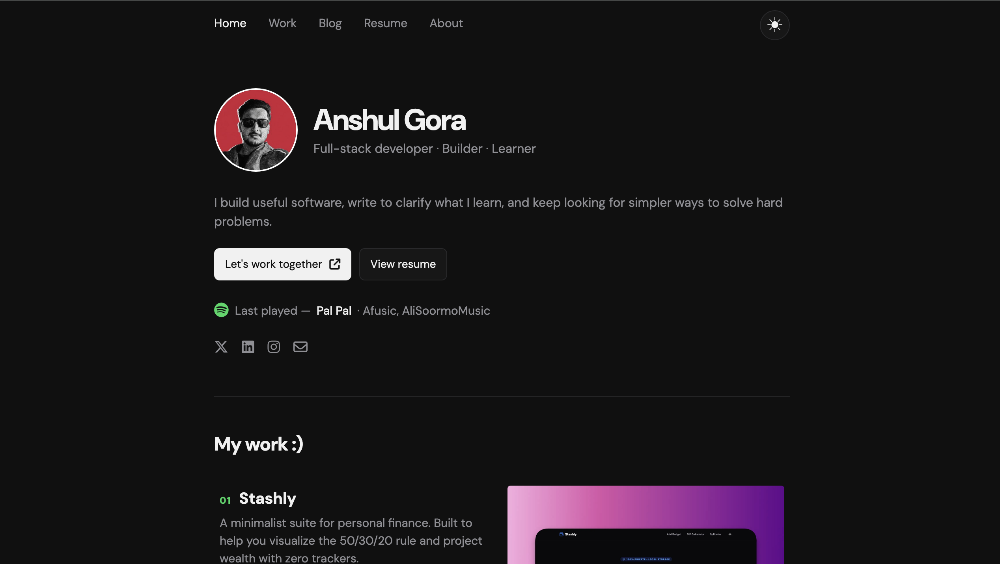

# 🚀 Professional Portfolio Template

A sleek, dark-themed, high-performance portfolio template built with **React**. This template is designed for developers and designers who want a "plug-and-play" solution to showcase their work, skills, and testimonials.

> ⭐ If you find this template useful, please consider starring the repo to support the project.

## 📸 Preview



> Replace the placeholder image above with your own project screenshot and keep it saved as screenshot.png in the repository root for the preview to render correctly.

## ✨ Features

- **Responsive Design**: Looks great on all devices
- **Dark Theme**: Modern and eye-catching
- **Easy Customization**: Edit a single JSON file to personalize
- **Fast Performance**: Optimized for speed
- **React Powered**: Built with React for dynamic content

**Live Demo:** [anshuldev.vercel.app](https://anshuldev.vercel.app)

---

## 🛠️ Quick Start

1. **Clone the Repository:**

   ```bash
   git clone <your-repo-url>
   cd portfolio_template_v1
   ```

2. **Install Dependencies:**

   ```bash
   npm install
   ```

3. **Run Locally:**
   ```bash
   npm start
   ```

---

## 🎨 Customization Guide

Follow these steps to personalize your website. All major content changes are handled through a single JSON file.

### 1. Meta Data & Favicon

Before editing the content, update the identity of your site in the browser:

- **Website Title**: Open `public/index.html` and update the `<title>` tag to your name.
- **Favicon**:
  1. Generate a custom icon at [favicon.io](https://favicon.io).
  2. Download and replace the existing files in the `public/` folder with your new icons.

### 2. The "Brain" (content.json)

All text and links are managed in `src/data/content.json`. Modify this file to reflect your information:

#### Profile

- **Name & Tagline**: Your professional identity and a catchy mission statement.
- **About Me**: A detailed paragraph describing your expertise and goals.
- **Contact & CV**: Your email, social links, and a link to your CV (hosted on Drive/Dropbox).

#### Projects

Add your work details here.

- **Description**: Keep project details to a 29-word maximum for the best layout.
- **Tech**: List technologies used (e.g., `#react #nodejs`).

#### Testimonials

- **Review**: Aim for 8 to 10 words per testimonial.
- **Company/Domain**: The affiliation of the person providing the review.

### 3. Assets (Images)

Images are stored in `src/assets/`. You can either:

- Replace the files in the folder using the exact same filenames (e.g., replace `anshul.jpg` with your own photo named `anshul.jpg`).
- Update the filenames in `content.json` to match your new uploaded files.

---

## 📂 Folder Structure

```
src/
├── assets/          # Profile photos, project screenshots, and avatars
├── components/      # Reusable React components (Navbar, ProjectCard, etc.)
├── data/
│   └── content.json # THE ONLY FILE YOU NEED TO EDIT FOR CONTENT
├── App.js           # Main application logic
└── index.js         # Entry point
```

---

## 🚀 Deployment

This template is optimized for Vercel.

1. Push your changes to your GitHub repository.
2. Import the project into Vercel.
3. Vercel will automatically detect React and deploy your site to a live URL.

---

## 📄 License

This project is open source and available under the [MIT License](LICENSE).

---

Made with ❤️ by [Anshul Gora](https://anshulwork.netlify.app/)
